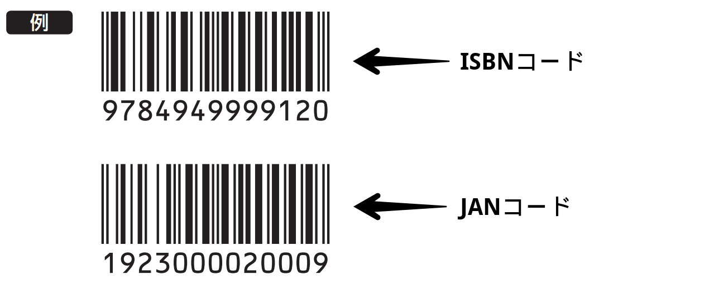

# 商業出版と技術同人誌の違い

　技術同人誌について書く前に、一般的な書店などで流通する商業誌との違いを解説します。筆者は商業誌で何冊か執筆した経験があるため、両社の違いについていくつかの観点で比較してみましょう。
 
 ## 工程の違い
 
 　商業誌と技術書では、その工程と役割分担が異なります。 企画・執筆・図版作成・編集・レイアウト・印刷所への入稿・校正・配本・販売まで別々の担当者や企業が担うのが商業誌、基本的に一人またはサークルで行うのが同人誌です。

| 工程 | 同人誌 | 商業誌 |
| -------- | -------- | -------- |
| 企画  | 伝えたいという気持ちのみ  | 市場・競合調査、切り口などの打ち合わせ |
| 執筆  | 約20-150P程度  | 300P前後 |
| 図版作成  | 自分で描く  | DTPデザイナーが描く |
| 編集  | 自分で編集  | プロの編集者が編集 |
| レイアウト  | 簡易なレイアウト  | DTPによる本格レイアウト |
| 入稿・印刷  | 自分でデータ作成、同人向け印刷所を利用  | DTPオペレータが入稿、大規模な印刷所を利用 |
| 校正  | 自力で見直す  | 編集者が校正 |
| 配本  | 印刷所からイベント会場へ  | 取次が全国の書店へ |
| 販売  | イベント及び通販直売  | 書店やAmazonで販売 |
| 入金  | 現地で現金または通販サイトから売れるごとに入金  | 印刷が行われるたびに印税が確定、発売後に入金 |

　特に大きなポイントとしては、商業誌の場合著者は一般的に企画と執筆にしか関わりませんが、同人誌の場合それを形にして読者に手渡しするところまで著者が担うため、後工程が占めるウェイトが大きいともいえます。それでは、それぞれの工程について詳しく見ていきましょう。
 
## 企画

　商業誌の場合は、一般的に編集部の担当編集が著者を見つけてきて「こういう本を書きませんか」などと壁打ちをするところから始まります。基本的には著者の方が専門分野の知識は豊富なので著者に相談しながら、既存の同ジャンルの本の売上情報などをもとに企画会議で決定されます。後述しますがこの段階でISBNが割り当てられることが多いようです。
 
 　一方、同人誌の場合は、著者が書きたいと思えばそれで（ひとまずは）終了です。特に書くボリュームに下限はありませんので、一般的な商業誌では1章分にしかならないようなニッチな企画でも十分成立します。できれば、「同好の志を増やす」という目的の元、新しく出会う読者を沼に引きずり込むような内容が良いでしょう。
	

## 執筆・校正

　執筆については大きな違いはありませんが、商業誌の場合は著者と編集者双方が利用しやすいフォーマットで執筆するほうが良いでしょう。一つの原稿を著者が執筆し、編集者が校正するため、版の管理や最終のデザイン案に流し込んだ時を想定し、Wordなどで執筆するケースが多いようです。

　同人誌の場合は、後工程も自分で行うため、自分がとにかく使いやすいツールで執筆することが重要です。また、エンジニアの方が多いので版の管理もGitHubを利用する方も多いようです。校正に関しては、自分でやるか同僚など誰かに査読してもらいますが、機械的な校正であればRedpenやtextlintなどの校正ツールをビルドしてエディタに組み込むこともよいでしょう。
 
## 編集・レイアウト

　編集がカバーする範囲は広いのですが、ここでは全体的にテキストを修正したり、構成を入れ替えたりして、読みやすい本に仕上げる作業を指します。商業誌の場合はInDesignに流し込んで実際の紙面デザインを行いながら編集することが多いので、ページごとのボリュームにも気を使います。埋め込む図版や表もデザイナーがリライトしてくれる場合が多いでしょう。

　同人誌の場合は、デザイナー系の方を除いて最終的な紙面デザインは執筆環境からコマンドやエクスポートツールを使って流しだす程度が多いです。実際に印刷して読んでみて、読みづらいところを修正するという流れになるでしょう。
 
 ## 印刷所への入稿
 
 　多くの人が初めての時にてこずるのが印刷所への入稿です。家庭用のプリンタで出力するのとは違い、専用の大型機械で出力するため独自のルールがあり勝手が異なります。例えば以下のようなルールがあります。
	
- ページごとにトンボと呼ばれる枠線を付ける
- 最終出来上がりよりひと回り広い紙に印刷して裁断する
- 4や8の倍数でページ数を決める
- 画像はRGBではなくCMYKという色方式
- 表紙データは別入稿
- 紙の種類が複数あり製品名になっている（「b7バルキー」など）
- 出来上がりまで数日間から数週間かかる
 
　商業誌の場合はDTPオペレータさんがそのあたりをよろしくやってくれるので、特に著者は困ることがありません。編集の段階でページ数を4や8の倍数にする調整も既に済んでいるでしょう。

　しかし、同人誌の場合はこれらを自分で行う必要があります。幸いなことに同人誌に特化した印刷所が多数あり、間違ったデータを出したら丁寧に修正方法を教えてくれるため「どうにかなる」ことが多いです。しかし、それらの手直しにも時間が掛かるので、締め切りとの戦いになるでしょう。
 

## 配本・販売

　無事に刷り上がったら販売です。商業誌の場合は出版社から取次と呼ばれる書籍専門商社を通して各書店に配本されます。このため、全国の中堅以上の書店にいきわたるには初版2,000部程度は必要といわれています。

　同人誌の場合は、コミケや技術書典などイベントに合わせて本を出すことが多いので、そういった即売会であれば印刷所から直接イベント会場に発送してもらったり、自分で持ち込んだりします。通販では、ピクシブ社運営のbooth[^1]などの委託販売サービスに委託することで、紙や電子どちらでも販売することが可能です。

　同人誌は一般的には書店に並べることができません。国内で流通させるには、ISBNと呼ばれる書籍コードを有料で取得し[^2]、それらをお店のレジで読み込めるようカタログデータにしてもらう必要があります。同人誌はあくまで流通の観点からはパンフレットの一種として分類されます。

　同様に、Kindleなど商業誌のプラットフォームで電子書籍を販売する場合も、ISBNコードを取得するか、Kindle Direct Publishing（KDP）[^3] プログラムといった公式の出版ツールを通じての販売が必要です。
 

　これらの違いをまとめると、商業誌は多くの会社や人の力でお客さんに届けられる分、確実にニーズがあり内容がしっかりしている本であるべきです。一方で同人誌は、自作のプログラムや電子工作を披露するのと同じように、自分が良いと思った知識をパッケージングして人に見せるアウトプットの形態といえるでしょう。ボリュームや価格はともに、商業誌の3分の1程度が多く、まだ流行前の新しい技術や、人口が少ないニッチな分野も多数発表されています。

[^1] [BOOTH](https://booth.pm/) 
[^2] [日本図書コード管理センター](https://isbn.jpo.or.jp/) 
[^3] [Amazon Kindle ダイレクト・パブリッシング](https://kdp.amazon.co.jp/)